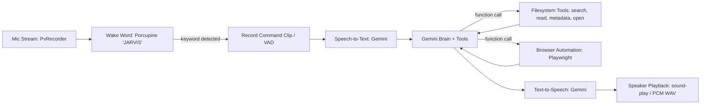

# J.A.R.V.I.S. Desktop Voice Assistant

A local, intelligent desktop assistant built in **Node.js** and **TypeScript**, powered by **Google Gemini** for reasoning, speech-to-text, and speech synthesis, with **Playwright** browser automation and strict system guardrails.

---

## Architecture



---

## Key Features

1. **Dual Interaction Modes**:
   - **Voice Mode**: Always-listening for the wake word **"JARVIS"** using `@picovoice/porcupine-node` and `@picovoice/pvrecorder-node`. Once detected, records your voice command until pause/silence (Voice Activity Detection), transcribes it via Gemini STT, executes your request, and speaks the reply aloud.
   - **Interactive CLI Mode**: You can also type commands directly into the terminal (`Jarvis ❯ `) at any time. Ideal for quiet environments or when working without a microphone.
2. **Phase 1 System & App Tools**:
   - `searchFiles(query, root?)`: Searches for files, defaulting to user home directory.
   - `getFileMetadata(path)`: Retrieves size, creation, modification, and access timestamps.
   - `readFileContent(path, maxChars)`: Reads plain text content safely, refusing binary files.
   - `openFile(path)`: Opens any safe local file with the OS default application.
   - `openApplication(name)`: Launches desktop applications (e.g. `notepad`, `calc`, `chrome`).
3. **Element-Map Web Browsing (Playwright)**:
   - Dedicated browser profile (`browser_profile/`) launched headed by default.
   - `browserOpen(url)`, `browserSearch(query)`: Navigates and enumerates visible interactive elements into numbered tags (`[1]`, `[2]`, ...).
   - `browserClick(ref)`, `browserType(ref, text, pressEnter)`: Interacts with elements by numeric reference.
   - `browserReadPage()`: Reads page content and returns updated element tags.
   - **Guardrails**: Automatically detects login, password, checkout, and payment pages, pausing for explicit user confirmation before executing any sensitive action.
4. **Natural Voice TTS**:
   - Speaks replies aloud using Gemini's native audio generation with prebuilt voices (default: `Fenrir`).
5. **Phase 2 Safe Write & Trash Deletion (`filesWrite.ts`)**:
   - Modularized `writeFileContent` and `deleteFile`.
   - Uses `trash` to send files to the OS Recycle Bin instead of permanent deletion (`never` `fs.unlink`).
   - Requires explicit terminal confirmation before modifying or deleting.
   - *Note: Phase 2 tools are intentionally modularized and kept out of the active Phase 1 brain tool list until Phase 1 read/open operations have run reliably in production.*

---

## Environment Variables (`.env`)

Your `.env` file is automatically ignored by Git (`.gitignore`). Configure the following variables:

| Variable | Description | Default |
|---|---|---|
| `GEMINI_API_KEY` | Your Google Gemini API Key | *(Required)* |
| `GEMINI_MODEL` | Gemini model name for brain reasoning and STT | `gemini-3.5-flash-lite` |
| `GEMINI_VOICE` | Voice name for TTS (`Fenrir`, `Puck`, `Aoede`, `Charon`, `Kore`) | `Fenrir` |
| `PICOVOICE_ACCESS_KEY` | Picovoice AccessKey for offline "JARVIS" wake-word | *(Optional for CLI, required for hands-free voice)* |
| `BROWSER_HEADLESS` | Run Playwright browser headless (`true` or `false`) | `false` |
| `EXTRA_DENY_LIST` | Semicolon or comma-separated additional directories to protect | *(None)* |

---

## Filesystem Guardrails (Deny-List)

To prevent accidental modification or inspection of critical system files, Jarvis enforces an active deny-list before any filesystem access:
- **Windows**: `C:\Windows` (including `System32`), `C:\Program Files`, `C:\Program Files (x86)`.
- **macOS**: `/System`, `/Library`, `/usr`, `/bin`, `/sbin`, `/private`.
- **Linux**: `/etc`, `/bin`, `/sbin`, `/usr`, `/boot`, `/lib`, `/proc`, `/sys`, `/dev`.

Attempting to touch a deny-listed directory immediately aborts the operation with a security guardrail exception.

---

## Setup & Running

### 1. Install Dependencies
```bash
npm install
```

### 2. Install Playwright Chromium
```bash
npx playwright install chromium
```

### 3. Configure `.env`
Ensure your `.env` contains:
```env
GEMINI_API_KEY=your_key_here
GEMINI_MODEL=gemini-3.5-flash-lite
PICOVOICE_ACCESS_KEY=your_free_picovoice_key_here
```
*(Get a free Picovoice key at https://console.picovoice.ai/ for wake-word support).*

### 4. Run Automated Tests
Verify all tools, guardrails, and Gemini connections:
```bash
npm test
```

## How to Run

### Option 1: One-Click Desktop Application (Recommended)
Launches the sleek, compact desktop assistant window (chatbox + Arc-Reactor voice button + minimized widget mode) and automatically starts the backend daemon:
```powershell
npm run app
```

### Option 2: Run Backend Only (Interactive CLI + Voice Wake-Word)
Starts the backend daemon with the interactive terminal prompt (`Jarvis ❯ `) and always-listening wake-word:
```powershell
npm run backend
# or
npm start
```

### Option 3: Run Frontend Web UI
Starts the Vite dev server at `http://localhost:5173`:
```powershell
npm run frontend
```

### Option 4: Run via Tauri v2
Launches the native Tauri desktop window:
```powershell
npm run tauri:dev
```

### Run Automated Tests
```powershell
npm test
```

---

## Project Structure

```
jarvis/
├── backend/                  # Fast, resilient assistant server & daemon
│   ├── src/
│   │   ├── brain.ts          # Smarter Gemini brain (memory, status events, retries)
│   │   ├── main.ts           # REST + SSE API server, wake word, CLI
│   │   ├── stt.ts            # Speech-to-text (Gemini multimodal audio)
│   │   ├── tts.ts            # Text-to-speech (Gemini native voice)
│   │   ├── config.ts         # Platform guardrails & deny-list
│   │   └── tools/            # Safe filesystem, app, and Playwright browser tools
│   ├── test/                 # Backend automated tests
│   ├── package.json
│   └── tsconfig.json
├── frontend/                 # Simple, compact desktop assistant program
│   ├── src/
│   │   ├── index.html        # Clean chatbox + Arc-Reactor voice button
│   │   ├── style.css         # Futuristic glassmorphism styling
│   │   └── app.ts            # Real-time SSE streaming & mic recording
│   ├── src-tauri/            # Tauri v2 native desktop application wrapper
│   │   ├── Cargo.toml
│   │   └── tauri.conf.json   # Compact window dimensions (380x560)
│   └── vite.config.ts
├── scripts/
│   └── launch-app.js         # Instant 1-click standalone desktop launcher
├── .env                      # API keys & settings (gitignored)
└── package.json              # Root orchestrator scripts
```

---

## Example Interactions

Once started, click the glowing Arc-Reactor, say **"JARVIS"**, or type directly in the chatbox:

```text
• "Search files for report in Documents"
• "What is the size and date of package.json?"
• "Open application notepad"
• "Search the web for the latest breakthroughs in AI"
• "Open https://github.com and read the page"
```

