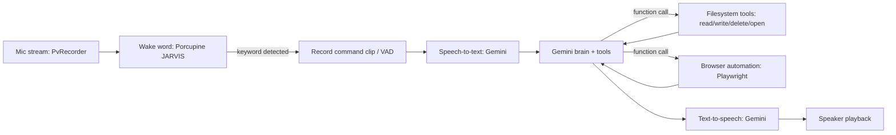

# Jarvis Voice Assistant — Implementation Plan (Node.js / TypeScript)

## Goal

Build a local, always-listening voice assistant in **Node.js / TypeScript**. Say **"Jarvis"** or **"Hey Jarvis,"** speak a request, and it will:
- Transcribe the speech to text.
- Send it to **Gemini** (Google's API, using a `GEMINI_API_KEY`) to decide what to do.
- Read, open, and (in a later phase) write/delete files anywhere on the machine except a deny-listed set of OS-critical directories; open any application; and actually drive a browser — open it, type a search, click a result, read the page back.
- Speak the reply back out loud.

One Gemini API key covers transcription, reasoning/tool-calling, and speech generation. Browser control is via Playwright, no API key needed there.

## Architecture



## Tech stack

| Piece | Package | Notes |
|---|---|---|
| Gemini SDK | `@google/genai` | Official TypeScript/JavaScript SDK. **Not** the deprecated `@google/generative-ai`. Check its current Node.js version requirement first. |
| Wake word | `@picovoice/porcupine-node` | Built-in `JARVIS` keyword — no training needed. Needs a free Picovoice AccessKey. |
| Mic capture | `@picovoice/pvrecorder-node` | Cross-platform frame-by-frame audio capture, feeds Porcupine and records command clips. |
| Audio playback | `speaker` | Plays raw PCM audio in Node — Gemini TTS returns 16-bit PCM directly consumable here. |
| Browser automation | `playwright` | Drives a real Chromium/Firefox/WebKit browser. Run `npx playwright install` after adding it. |
| Open files/apps | `open` | Cross-platform "open with default app". |
| **Safe delete** | **`trash`** | Moves files to the OS recycle bin/trash instead of permanently deleting them — the actual safety net for delete operations, see below. |
| File metadata | Node's built-in `fs`/`fs.promises` | `fs.stat(path)` gives `mtime`/`atime` directly. |

**Note:** Google's model lineup changes over time — check https://ai.google.dev/gemini-api/docs/models for current model names before hardcoding any version string.

## Project structure

```
jarvis/
├── src/
│   ├── main.ts               # wake word -> record -> STT -> brain -> TTS loop
│   ├── brain.ts               # Gemini client, tool-calling loop
│   ├── tools/
│   │   ├── files.ts             # searchFiles, readFileContent, getFileMetadata
│   │   ├── filesWrite.ts          # writeFileContent, deleteFile (Phase 2, gated)
│   │   ├── apps.ts               # openFile / openApplication (via `open`)
│   │   └── browser.ts             # browserOpen, browserClick, browserType, browserReadPage
│   ├── stt.ts                 # audio buffer -> text via Gemini
│   ├── tts.ts                 # text -> audio via Gemini, playback via `speaker`
│   └── config.ts               # API keys, denyList, voice choice
├── package.json
├── tsconfig.json
└── .env.example                # GEMINI_API_KEY=, PICOVOICE_ACCESS_KEY=
```

## Filesystem access: deny-list, not allow-list

Full access, minus a blocked set of OS-critical directories:

- **Windows:** `C:\Windows` (covers `System32`), `C:\Program Files`, `C:\Program Files (x86)`
- **macOS:** `/System`, `/Library`, `/usr`, `/bin`, `/sbin`, `/private`
- **Linux:** `/etc`, `/bin`, `/sbin`, `/usr`, `/boot`, `/lib`, `/proc`, `/sys`, `/dev`

`config.ts` should build this list based on `process.platform` and let the user append more paths via an env var (e.g. to also protect `~/.ssh` or a browser profile with saved passwords, which the blocklist above doesn't cover).

**Be aware of the actual risk shape here:** a deny-list only blocks the paths someone thought to list. It won't stop Jarvis from misreading a request and deleting the wrong personal file elsewhere on disk — a model acting on ambiguous instructions is the realistic failure mode, not it tunneling into `System32`. That's exactly why write/delete get built as their own gated, confirmed, undo-able phase below rather than shipping alongside read access on day one.

## Tools to expose to Gemini

**Phase 1 — read/open (build this first):**
- `searchFiles(query, root?)` → matching paths, checked against the deny-list. `root` optional; defaults to the user's home directory if omitted.
- `getFileMetadata(path)` → `mtime`, `atime`, size.
- `readFileContent(path, maxChars)` → text content for text-readable files; refuse/truncate binaries.
- `openApplication(name)` / `openFile(path)` → via `open`. Logged before executing.

**Phase 2 — write/delete (add only once Phase 1 has been used and trusted for a while):**
- `writeFileContent(path, content)` → checked against the deny-list, logged, and requires an explicit confirmation step before executing (same pattern as the browser login/checkout gate below).
- `deleteFile(path)` → implemented with the `trash` package (moves to OS recycle bin, **never** `fs.unlink`), so a bad call is a one-click undo instead of gone-forever. Also deny-list checked, logged, and confirmed.

**Browser tools** (see prior discussion — element-map pattern): `browserOpen(url)`, `browserClick(ref)`, `browserType(ref, text)`, `browserReadPage()`, `browserSearch(query)`.

## Guardrails

- Every filesystem tool call checks the target path against the deny-list before touching disk.
- Write and delete are a separate phase from read/open — don't wire them in until the read/open + browser loop has run reliably for a while.
- Delete uses `trash`, not permanent deletion, full stop.
- Write/delete/openApplication/browser-click-on-login-or-checkout all require an explicit confirmation step logged to the console before executing — echo back exactly what's about to happen.
- Run the Playwright browser in its own dedicated profile (not your real Chrome profile) and headed, not headless, so you can see what it's doing.
- No generic shell-execution tool, ever — only the specific named functions above.
- Log every tool call and its arguments.

## Build order

1. **Text-only brain, Phase 1 file tools + browser tools.** Verify search, metadata, and browser automation all work correctly from typed input.
2. **Add TTS**, then **STT**, then the **wake word** — same order as before, now on top of a working tool set.
3. **Polish**: silence-based recording cutoff, latency tuning, "didn't catch that" handling.
4. **Only after the above is stable and you trust it:** add Phase 2 write/delete tools, with the confirmation + `trash` behavior above.

---

## Instructions for the AI building this

Build a TypeScript Node.js project with the structure above. Specifically:

1. Initialize a Node.js + TypeScript project. Install `@google/genai`, `@picovoice/porcupine-node`, `@picovoice/pvrecorder-node`, `speaker`, `open`, `trash`, and `playwright` (run `npx playwright install` afterward).
2. `src/config.ts`: build a platform-aware `denyList` (Windows/macOS/Linux paths as listed above) based on `process.platform`, extendable via an env var. Load `GEMINI_API_KEY` and `PICOVOICE_ACCESS_KEY` via `dotenv`.
3. `src/tools/files.ts`: implement `searchFiles`, `getFileMetadata`, `readFileContent`, each checking the resolved absolute path against `denyList` and refusing if it falls inside a denied directory.
4. `src/tools/filesWrite.ts`: implement `writeFileContent` and `deleteFile` (using `trash`, never `fs.unlink`/`fs.rm`), both deny-list checked and both requiring a confirmation callback to return `true` before executing. Keep this module separate and do not wire it into `brain.ts`'s tool list until told to add Phase 2.
5. `src/tools/apps.ts`: implement `openFile`/`openApplication` via `open`, logging before each call.
6. `src/tools/browser.ts`: launch Playwright with its own dedicated user-data directory, headed by default. Implement `browserOpen`, `browserClick`, `browserType`, `browserReadPage`, `browserSearch` using the element-map pattern: after every navigation/action, enumerate interactive elements, assign numeric refs, keep a ref→Locator map, return a text summary. Require confirmation before any click/submit on a detected login/checkout/payment page.
7. `src/brain.ts`: declare Phase 1 file tools, app tools, and browser tools as Gemini `FunctionDeclaration`s. Implement the tool-call loop (call → execute function call → send `functionResponse` → repeat until plain text). Print every call and its arguments.
8. `src/stt.ts` / `src/tts.ts`: as before — Gemini transcription in, Gemini TTS out through `speaker`.
9. `src/main.ts`: text/keypress input first; swap in Porcupine + PvRecorder for the wake word once that loop works.
10. README covering all env vars, the Playwright install step, and a clear note that Phase 2 (`filesWrite.ts`) is intentionally not wired into the brain's tool list yet — that's a deliberate later step, not a bug.

Never implement a generic shell-execution tool. Never wire `filesWrite.ts` into the active tool list without a working confirmation flow in place first.
