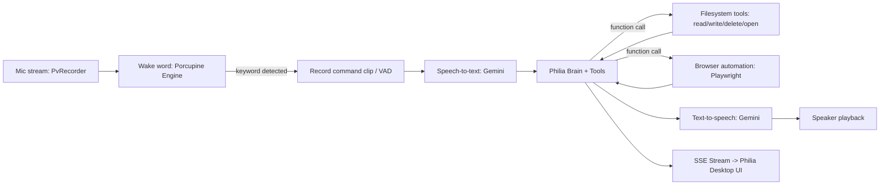

# Philia Voice & Desktop Assistant — Implementation Plan (Node.js / TypeScript)

## Goal

Build a local, always-listening desktop voice and holographic chat assistant in **Node.js / TypeScript** named **Philia** (**P.H.I.L.I.A.** — **Precise Holographic Intelligence and Logical Interface Assistant**). Say **"Philia"**, tap the glowing holographic core, or enter typed commands, and it will:
- Transcribe speech to text with Gemini Speech-to-Text.
- Reason and execute tools using **Gemini** (Google's official `@google/genai` SDK).
- Read, search, open, write, and safely recycle files across the machine with strict OS deny-list protection.
- Control desktop applications and drive automated web browsing via Playwright.
- Speak replies aloud using Gemini TTS and stream live status updates to the compact desktop UI.

---

## Architecture



---

## Tech Stack

| Piece | Package | Notes |
|---|---|---|
| Assistant Core | Philia (`P.H.I.L.I.A.`) | Precise Holographic Intelligence and Logical Interface Assistant |
| Gemini SDK | `@google/genai` | Official TypeScript/JavaScript SDK for reasoning, tools, STT, and TTS. |
| Wake word | `@picovoice/porcupine-node` | Offline wake-word detection engine. |
| Mic capture | `@picovoice/pvrecorder-node` | Cross-platform frame-by-frame audio capture with RMS voice activity detection. |
| Audio playback | `sound-play` | Reliable WAV playback through system speakers. |
| Browser automation | `playwright` | Real Chromium browser control with ref-based element indexing. |
| Open files/apps | `open` | Cross-platform desktop application and document launcher. |
| Safe file recycling | `trash` | Moves files to OS Recycle Bin instead of hard deletion. |
| Frontend UI | `vite` + Vanilla TS + Tauri | Compact glowing holographic desktop HUD and widget. |

---

## Directory Structure

```
philia/
├── backend/
│   ├── src/
│   │   ├── main.ts              # HTTP & SSE server + CLI prompt + wake word loop
│   │   ├── brain.ts             # PhiliaBrain, Gemini chat session & tool dispatcher
│   │   ├── tools/
│   │   │   ├── files.ts         # searchFiles, readFileContent, getFileMetadata
│   │   │   ├── filesWrite.ts    # writeFileContent, deleteFile (recycle bin)
│   │   │   ├── apps.ts          # openFile, openApplication
│   │   │   └── browser.ts       # browserOpen, browserSearch, browserClick, browserType
│   │   ├── stt.ts               # Audio buffer -> text via Gemini
│   │   ├── tts.ts               # Text -> WAV via Gemini TTS
│   │   └── config.ts            # Configuration, deny-list security, environment variables
│   ├── test/
│   │   └── test_backend.ts      # Automated unit tests for backend and PhiliaBrain
│   └── package.json             # philia-backend
├── frontend/
│   ├── src/
│   │   ├── app.ts               # Client SSE listener, speech triggering, UI controller
│   │   └── style.css            # Futuristic holographic neon dark styling
│   ├── src-tauri/               # Native desktop wrapper config
│   ├── index.html               # Main holographic HUD interface
│   └── package.json             # philia-frontend
├── scripts/
│   └── launch-app.js            # Unified desktop app and backend launcher
├── test/
│   ├── test_all.ts              # Comprehensive end-to-end integration tests
│   └── test_e2e_api.ts          # HTTP & SSE API test suite
└── package.json                 # Root orchestration package: philia-assistant
```
